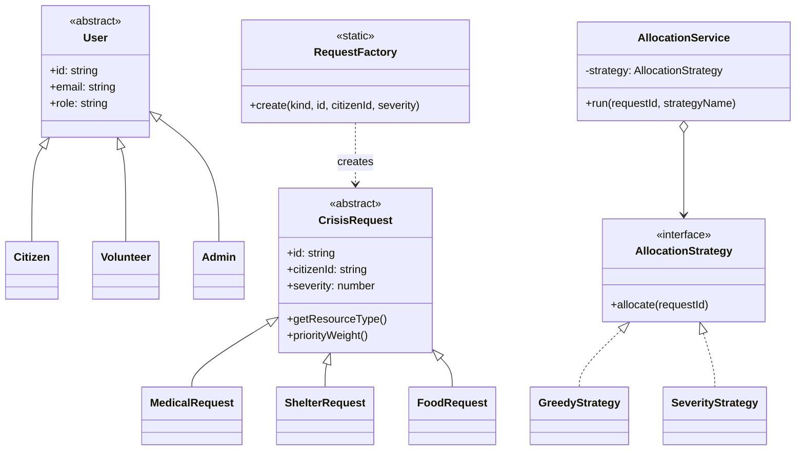
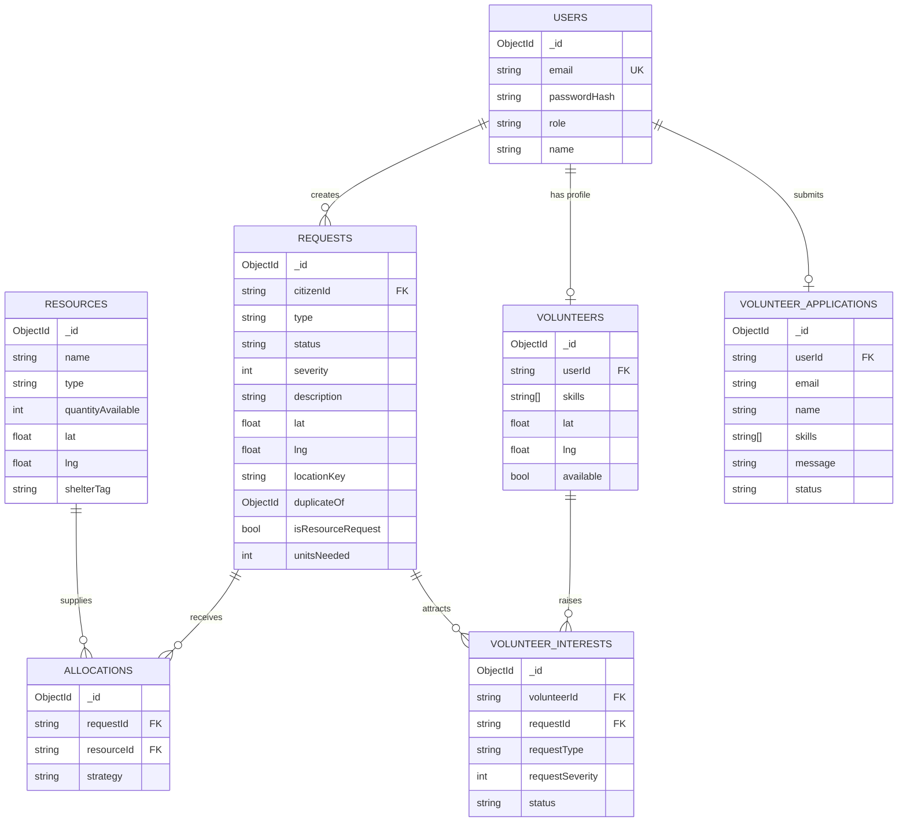
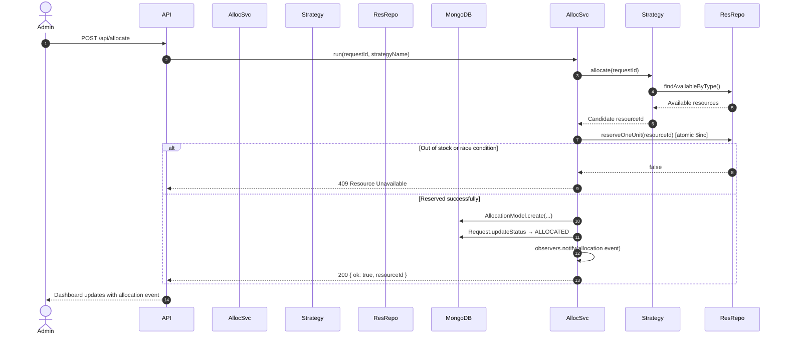
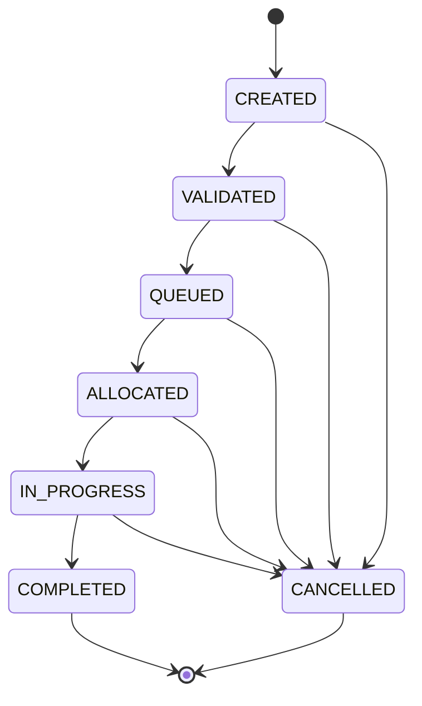

<div align="center">

# 🚨 ReliefOps

### Crisis Relief Coordination Platform

**A full-stack disaster response system that connects citizens, volunteers, and admins — with real-time resource allocation, a live operations dashboard, and a volunteer portal.**

<br/>


[](https://relief-ops-two.vercel.app/)

<br/>

[Live Demo](https://relief-ops-two.vercel.app/) · [Documentation](#architecture) · [Project Structure](#project-structure) · [Quick Start](#setup--installation) · [Tests](#testing)

---

</div>

## Overview

ReliefOps is a capstone-level **crisis relief coordination** web application built for real disaster scenarios. It solves critical operational challenges:

- Volunteers don't know where to go
- Shelters are unaware of incoming capacity
- Resources (food, beds, medicine) are misallocated
- High-priority cases get delayed due to duplicate requests

**ReliefOps solves this with:**

- Real-time resource tracking and matching engine
- Intelligent allocation strategies — Greedy vs. Severity-first
- Atomic, conflict-free priority-based queuing
- Admin control center with a live map dashboard and allocation event feed
- Volunteer portal with application approval workflow and interest-raising
- Role-Based Access Control (RBAC) enforced at middleware and API layers

---

## Tech Stack

| Layer | Technology |
|-------|-----------|
| Language | TypeScript 5 |
| Framework | Next.js 15 — App Router, React 19 |
| UI & Styling | Tailwind CSS 3 |
| Server State | TanStack React Query v5 |
| Client State | Redux Toolkit |
| Auth | NextAuth.js v4 — Credentials + JWT |
| Database | MongoDB via Mongoose 8 |
| In-Memory DB | `mongodb-memory-server` (auto fallback when `MONGODB_URI` is absent) |
| Map | Google Maps via `@vis.gl/react-google-maps` |
| Tests | Jest 29 + `jest-environment-jsdom` |

---

## Setup & Installation

### Prerequisites

- **Node.js 20+**
- **Zero-Config Execution** — when `MONGODB_URI` is absent, an in-memory MongoDB instance spins up automatically. No local MongoDB needed.

### Environment Variables

Create `.env.local` in the project root:

```env
# Required
NEXTAUTH_SECRET=your_secret_key_here
NEXTAUTH_URL=http://localhost:3000

# Optional — omit to use the in-memory MongoDB fallback
MONGODB_URI=mongodb+srv://<user>:<password>@cluster.mongodb.net/ReliefOps

# Optional — enables the live Google Maps view on the dashboard
NEXT_PUBLIC_GOOGLE_MAPS_API_KEY=your_google_maps_api_key
```

### Run Locally

```bash
npm install
npm run dev
```

Open [http://localhost:3000](http://localhost:3000)

### Run Tests

```bash
npm test
```

---

## Project Structure

```
reliefops/
├── __tests__/
│   └── unit/
│       ├── AllocationStrategy.test.ts
│       ├── RequestFactory.test.ts
│       └── RequestStateMachine.test.ts
├── middleware.ts                        # JWT-based RBAC middleware
└── src/
    ├── app/
    │   ├── (admin)/                     # Dashboard, Requests, Resources, Volunteers
    │   ├── (auth)/                      # Login, Register
    │   ├── (citizen)/                   # Submit Request, Track Status
    │   ├── (volunteer)/                 # Volunteer Portal, Pending Approval
    │   └── api/                         # Route handlers
    │       ├── allocate/
    │       ├── auth/
    │       ├── requests/
    │       ├── resource-requests/
    │       ├── resources/
    │       ├── volunteer-applications/
    │       ├── volunteer-interests/
    │       └── volunteers/
    ├── components/                      # UI — auth, common, dashboard, map, requests
    ├── constants/                       # Roles, enums
    ├── domain/
    │   ├── models/                      # Mongoose schemas
    │   ├── patterns/
    │   │   ├── factory/                 # RequestFactory
    │   │   ├── observer/                # ObserverManager, DashboardObserver
    │   │   ├── singleton/               # MongoDB connection singleton
    │   │   ├── state/                   # RequestStateMachine, RequestStates
    │   │   └── strategy/                # AllocationStrategy, GreedyStrategy, SeverityStrategy
    │   ├── repositories/                # Data access layer + interfaces
    │   ├── request/                     # CrisisRequest, MedicalRequest, ShelterRequest, FoodRequest
    │   └── user/                        # User, Citizen, Volunteer, Admin
    ├── hooks/                           # TanStack Query hooks
    ├── lib/                             # mongodb.ts, auth.ts
    ├── services/                        # Use cases: Allocation, Request, Resource, Volunteer
    ├── store/                           # Redux Toolkit slices
    ├── types/                           # Shared TypeScript types
    └── utils/                           # Validators, distance helpers
```

---

## Architecture

### Layer Responsibilities

| Layer | Path | Role |
|-------|------|------|
| Presentation | `src/app` | Pages + API route controllers |
| Application | `src/services` | Use case orchestration |
| Domain | `src/domain` | Pure OOP models, patterns, interfaces |
| Infrastructure | `src/domain/repositories`, `src/lib` | Mongoose adapters, DB connection |
| UI | `src/components` | Tailwind-driven React components |

### Role-Based Access Control

| Role | Allowed Paths | Capabilities |
|------|--------------|--------------|
| `citizen` | `/submit-request`, `/track` | Submit and track own crisis requests |
| `volunteer` | `/portal` | View requests, raise interest, manage profile |
| `admin` | `/dashboard`, `/requests`, `/resources`, `/volunteers` | Full platform control |
| `shelter_manager` | `/dashboard`, `/resources` | Manage resources, view live dashboard |

### Concurrency & Load Handling

- **Stateless API handlers** — JWT sessions, horizontally scalable with no shared session state
- **Virtual priority queue** — requests sorted by `severity DESC` from DB on `status: QUEUED`
- **Atomic allocation** — `$inc: { quantityAvailable: -1 }` with `{ $gt: 0 }` guard; compensation rollback via `releaseOneUnit()` on any downstream failure
- **Duplicate detection** — requests fingerprinted by `(citizenId, type, locationKey)`

---

## Software Engineering Principles

### Object-Oriented Programming

- **Abstraction / Inheritance** — `User` → `Citizen`, `Volunteer`, `Admin`; `CrisisRequest` → `MedicalRequest`, `ShelterRequest`, `FoodRequest`
- **Polymorphism** — `priorityWeight()` and `getResourceType()` behave uniquely per subclass
- **Encapsulation** — All Mongoose details sealed inside `RequestRepository`, `ResourceRepository`, `UserRepository`

### SOLID Principles

| Principle | How It's Applied |
|-----------|-----------------|
| **S** — Single Responsibility | Services orchestrate; repositories store; routes control |
| **O** — Open/Closed | New strategy (e.g. `DistanceStrategy`) needs only to implement `AllocationStrategy` |
| **L** — Liskov Substitution | All `CrisisRequest` subtypes are interchangeable throughout the domain |
| **I** — Interface Segregation | `IRequestRepository`, `IResourceRepository`, `IUserRepository` are minimal and focused |
| **D** — Dependency Inversion | `AllocationService` depends on abstract interfaces, never on concrete models |

### Design Patterns

| Pattern | Files | Purpose |
|---------|-------|---------|
| Strategy | `AllocationStrategy`, `GreedyStrategy`, `SeverityStrategy` | Swap matching algorithms at runtime |
| Factory | `RequestFactory` | Type-safe creation of `CrisisRequest` subclasses |
| State | `RequestStateMachine`, `RequestStates` | Enforce legal request state transitions |
| Observer | `ObserverManager`, `DashboardObserver` | Push allocation events to dashboard without coupling |
| Singleton | `connectMongo()` in `src/lib/mongodb.ts` | Single persistent Mongoose connection |

---

## UML Diagrams

### Class Diagram



### ER Diagram



### Allocation Sequence



### Request State Machine



---

## API Endpoints

| Method | Endpoint | Auth | Description |
|--------|----------|------|-------------|
| `GET` | `/api/requests` | Any role | List requests (filtered by role) |
| `POST` | `/api/requests` | Citizen, Admin | Submit a new crisis request |
| `GET` | `/api/resources` | Any role | List available resources |
| `POST` | `/api/resources` | Admin, Shelter Manager | Add a new resource |
| `POST` | `/api/allocate` | Admin, Shelter Manager | Run the allocation engine |
| `GET` | `/api/volunteers` | Admin | List all volunteers with user info |
| `GET/POST` | `/api/volunteer-applications` | Volunteer / Admin | Apply or manage volunteer applications |
| `GET/POST` | `/api/volunteer-interests` | Volunteer / Admin | Raise or manage interest in a request |
| `GET/POST` | `/api/resource-requests` | Volunteer | Request a resource |
| `POST` | `/api/auth/[...nextauth]` | Public | NextAuth sign-in / sign-out / session |

---

## Testing

Unit tests live in `__tests__/unit/` and cover the core domain logic:

| Test File | What It Covers |
|-----------|---------------|
| `AllocationStrategy.test.ts` | `GreedyStrategy` and `SeverityStrategy` pick logic |
| `RequestFactory.test.ts` | `RequestFactory.create()` returns correct subclass instances |
| `RequestStateMachine.test.ts` | Legal and illegal state transitions |

```bash
npm test
```

---

<div align="center">

Made with ❤️ for disaster relief coordination &nbsp;·&nbsp; Capstone Project 2026

</div>
